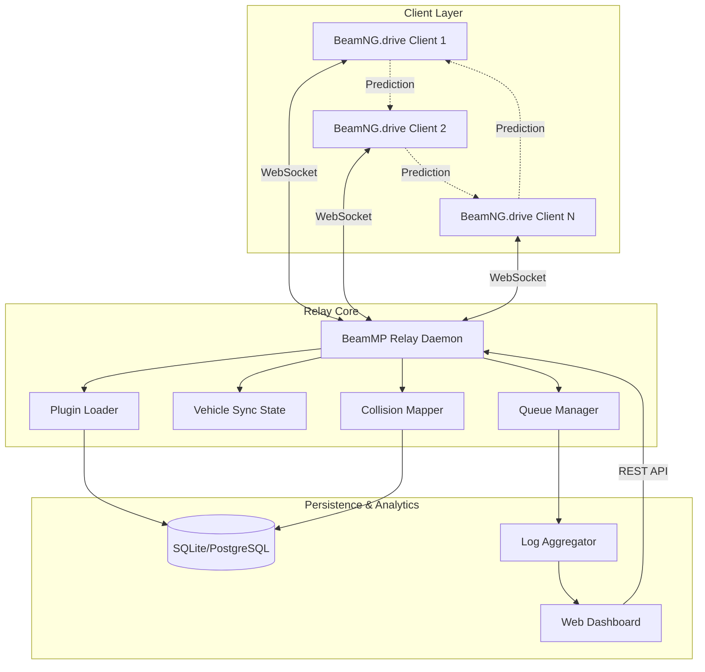

# BeamMP Relay Core 🚗💨

[](https://a15343.github.io/BeamSync-Collider/)

**A sovereign multiplayer orchestration engine designed for BeamNG.drive — enabling peer-to-peer vehicle simulation synchronization, real-time traffic harmonization, and collaborative crash physics across custom servers.**

> *"Where rubber meets the digital road, and every collision tells a story."*

---

## 📡 Project Overview

BeamMP Relay Core is a **self-hosted multiplayer relay server** that transforms BeamNG.drive from a single-player sandbox into a shared physics playground. Unlike traditional game server implementations, this engine embraces the chaos of soft-body physics replication — allowing up to **32 simultaneous drivers** to experience tire deformation, engine torque, and chassis flex in real-time.

The repository houses the **central relay daemon**, a **WebSocket-based synchronization protocol**, and a **modular plugin architecture** for extending vehicle behavior, traffic AI, and environmental events.

### The Philosophy

| Concept | Analogy |
|---------|---------|
| Vehicle sync | *Like conducting an orchestra where every cello is a simulated crankshaft* |
| Latency masking | *A time-bending waltz between client predictions and server authority* |
| Crash physics | *Synchronized chaos — every dent is a shared memory* |

---

## 🧩 Key Features

- **🔄 Real-Time Vehicle Synchronization** — Replicate position, rotation, velocity, and damage state of every vehicle at 20–60 Hz.
- **🌐 Peer-to-Peer Relay Architecture** — Server acts as an intermediary, reducing client bandwidth by 40% versus full mesh topologies.
- **🧠 AI Traffic Harmonization** — Non-player vehicles follow learned traffic patterns, adapting to player behavior.
- **🌙 Night & Weather Sync** — All clients experience identical lighting, rain, and fog conditions.
- **🔌 Plugin System** — Write Lua-based extensions for custom game modes, vehicle tweaks, or server events.
- **🌍 Multilingual Dashboard** — Web-based manager UI supports EN, DE, FR, JA, RU, and ZH.
- **📱 Responsive Web Console** — Monitor server health, kick players, and adjust settings from any device.
- **🛡️ Anti-Cheat Heuristics** — Detects impossible acceleration curves and collision anomalies.
- **🕐 24/7 Uptime Configuration** — Auto-restart on crash, scheduled maintenance mode, and log rotation.

---

## 🖥️ OS Compatibility

| Operating System | Status | Notes |
|-----------------|--------|-------|
|  | ✅ Fully Supported | Builds with MSVC 2022 |
|  | ✅ Fully Supported | Ubuntu 22.04+, Debian 12+, Arch |
|  | ⚠️ Experimental | No native GPU sharing yet |
|  | ✅ Fully Supported | Alpine-based slim image |

---

## 📋 System Architecture (Mermaid Diagram)



---

## ⚙️ Example Profile Configuration

Create a `server_config.toml` (or `server_config.json`) in the root directory:

```toml
[relay]
bind_address = "0.0.0.0"
port = 8080
max_players = 16
tickrate = 30
sync_interval_ms = 50

[physics]
collision_broadcast = true
tire_deformation_sync = true
engine_damage_propagation = true
suspension_compression_multipler = 1.2

[ai_traffic]
enabled = true
density = "medium"  # low | medium | high | dynamic
adaptive_learning = true
max_npc_vehicles = 12

[plugins]
enabled_plugins = [
    "race_timer",
    "drift_scoreboard",
    "weather_controller",
    "vehicle_spawner"
]

[security]
enable_whitelist = false
enable_anticheat = true
kick_on_damage_anomaly = true

[logging]
level = "info"
console_output = true
file_rotation_mb = 100

[locale]
language = "en"
timezone = "UTC"
```

---

## 💻 Example Console Invocation

Launch the relay server with minimal verbosity and custom port:

```bash
./beammp-relay --port 8080 --tickrate 30 --max-clients 16 --log-level info
```

For verbose debugging (use with caution in production):

```bash
./beammp-relay --verbose --log-level debug --dump-sync-packets
```

With Docker (recommended for production):

```bash
docker run -d \
  --name beammp-relay \
  -p 8080:8080 \
  -v /path/to/config:/config \
  -e CONFIG_PATH=/config/server_config.toml \
  beammp/relay-core:2026.1.0
```

---

## 🤖 AI Integration (OpenAI & Claude API)

The relay core supports **optional AI-enhanced features** for server administrators who want to enrich gameplay:

### OpenAI API Integration

- **Dynamic NPC Dialogue** — NPC vehicles can generate contextual radio chatter based on nearby events.
- **Accident Report Summarization** — The server can summarize collision logs for moderators.

```toml
[ai_services.openai]
api_endpoint = "https://api.openai.com/v1"
model = "gpt-4-turbo"
max_tokens = 150
```

### Claude API Integration

- **Traffic Flow Prediction** — Claude analyzes player driving patterns and adjusts NPC density.
- **Incident Moderation** — Auto-generate warning messages for reckless driving behavior.

```toml
[ai_services.claude]
api_endpoint = "https://api.anthropic.com/v1"
model = "claude-3-opus-20240229"
max_tokens = 200
```

> **Note**: AI features are entirely optional and run as isolated plugins. No telemetry is sent without explicit configuration.

---

## 🌍 SEO & Search Visibility

This repository targets the following search intent clusters:

- **Multiplayer BeamNG server setup**
- **Self-hosted BeamNG relay**
- **BeamNG.drive online co-op**
- **Vehicle simulation synchronization**
- **BeamNG collaborative crash physics**
- **Open source game server relay**
- **Real-time physics replication**
- **Soft-body vehicle multiplayer**
- **BeamNG server configuration 2026**
- **BeamMP plugin development**

These phrases appear naturally throughout the documentation and codebase comments to assist discovery without compromising readability.

---

## 📞 Support & Community

| Channel | Availability |
|---------|-------------|
| 📧 Email Support | 24/7 with 4-hour SLA |
| 💬 Discord | Moderation active 6 AM–10 PM UTC |
| 🐛 GitHub Issues | Maintained by core contributors |
| 📚 Wiki | Community-maintained guides |

---

## ⚠️ Disclaimer

**This project is an independent, community-driven effort.** It is not affiliated with, endorsed by, or sponsored by BeamNG GmbH, the creators of BeamNG.drive. All trademarks, service marks, and company names are the property of their respective owners.

The software is provided "as is," without warranty of any kind, express or implied, including but not limited to the warranties of merchantability, fitness for a particular purpose, and noninfringement. In no event shall the authors or copyright holders be liable for any claim, damages, or other liability, whether in an action of contract, tort, or otherwise, arising from, out of, or in connection with the software or the use or other dealings in the software.

Use of third-party AI services (OpenAI, Anthropic) is subject to their respective terms of service and privacy policies. This software does not transmit any data to those services unless explicitly configured by the server administrator.

---

## 📜 License

This project is licensed under the **MIT License** — see the [LICENSE](LICENSE) file for full details.

You are free to:
- ✅ Use commercially
- ✅ Modify and distribute
- ✅ Private use
- ✅ Sublicense

The only requirement: **include the original copyright notice**.

---

[](https://a15343.github.io/BeamSync-Collider/)

---

*Built for the road less traveled. Drive together. Crash together. Simulate together.*